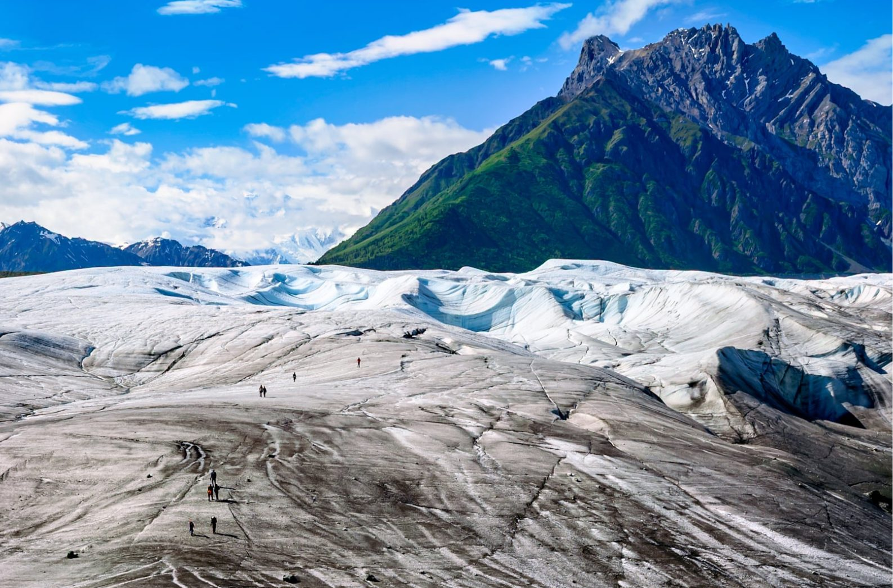
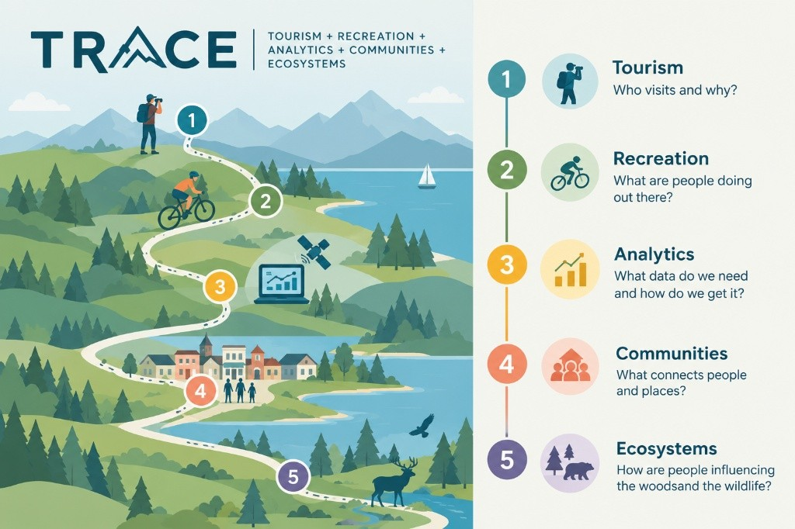
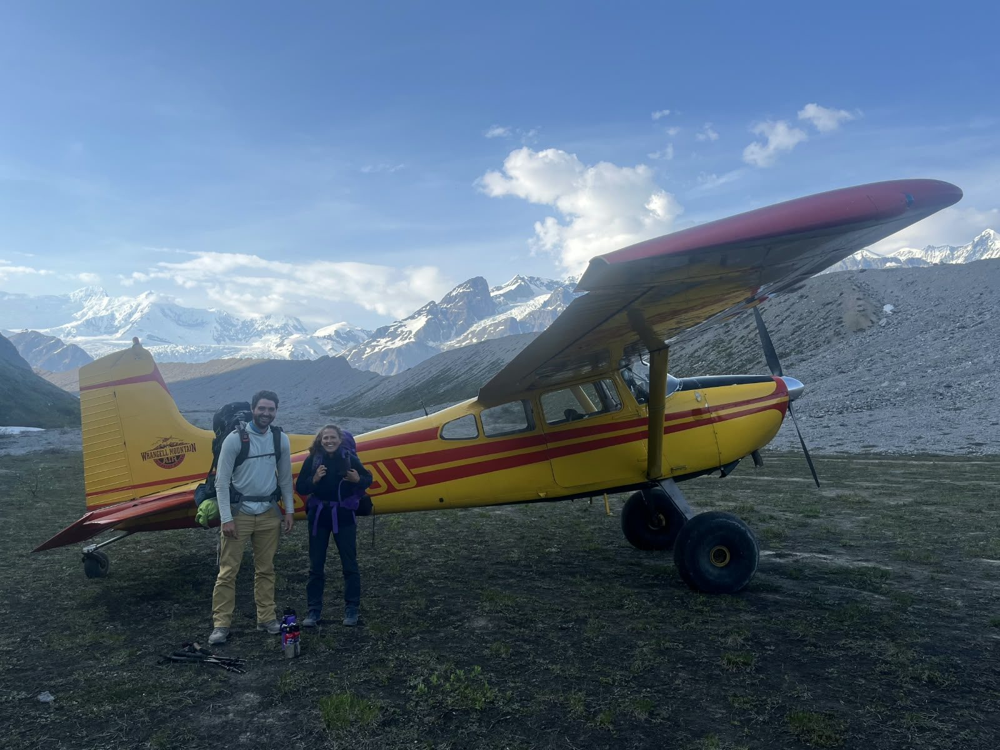
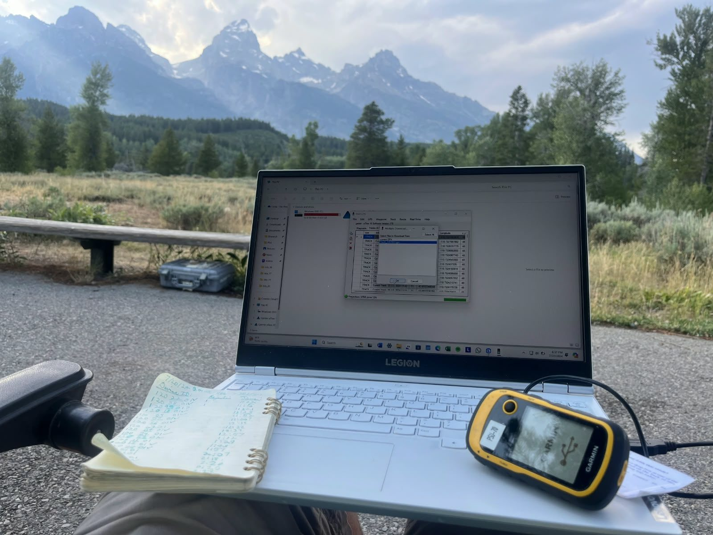
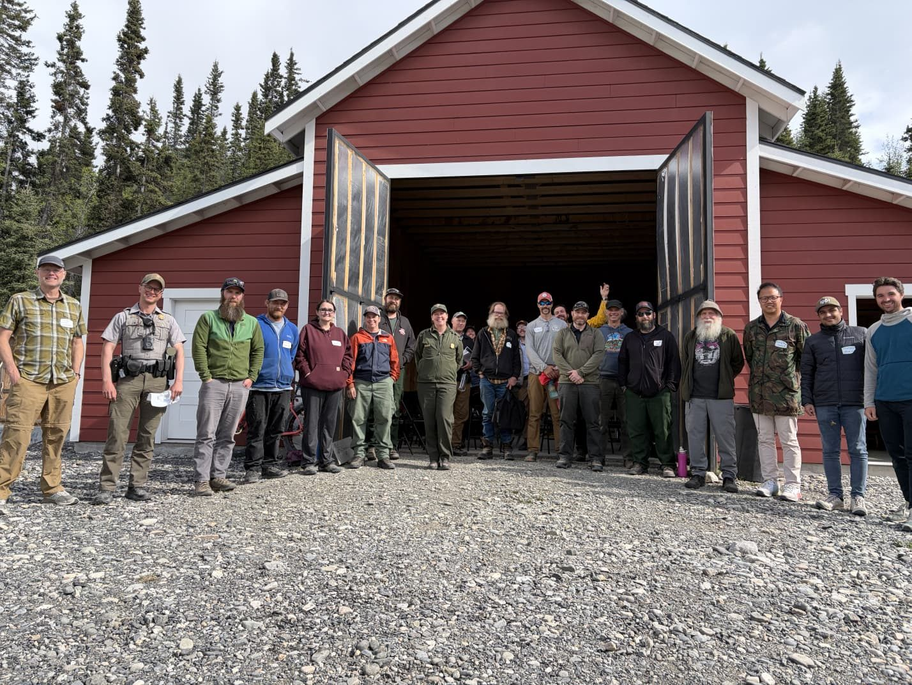

::: {.hero}

::: {.hero-inner}

Tourism and Recreation Analytics for Communities and Ecosystems (TRACE)

<h1>We study how people move through nature.</h1>

The TRACE Lab at the University of Wyoming's Haub School of Environment and Natural Resources does applied research with agencies and communities to understand recreation and tourism behavior, revealing which visitors go where and why, how visitors impact ecosystems and economies, and broader relationships between visitor use and nature exposure with health, safety, emerging technology, and more.

<a class="btn btn-sand" href="work-with-us.html">Work with us</a>
<a class="btn btn-ghost" href="people.html#join-the-lab">Join the lab</a>

:::

:::

::: {.section}

::: {.split}

::: {}

## Who we are

The Tourism and Recreation Analytics for Communities and Ecosystems (TRACE) Lab is led by Colby Parkinson, PhD, Assistant Professor of Outdoor Recreation and Tourism Management at the University of Wyoming. The lab launched in 2026 to build the evidence that managers and communities need to make decisions based on their visitation. This evidence is derived from tracing and tracking visitor numbers, behaviors, and backgrounds, the psychological pathways that lead to visitors' (and managers') behaviors and outcomes, and the routes to successful management through stakeholders, communities, and understanding of ecological systems. And our lab has the tools, knowledge, and resources to build that evidence. We specialize in field research that involves active participation with stakeholders to ground-truth our science alongside quantitative, spatial, and computational analyses that help us integrate field data with big data. Some of the methods we employ:

<ul class="toolkit">
<li>Community-based participatory research and mapping</li>
<li>Social data analysis and statistics</li>
<li>Trail counters and systematic observation</li>
<li>GPS and mobile device tracking</li>
<li>Intercept and online surveys</li>
<li>Semi-structured interviews</li>
<li>Facilitated exercises for training and discussion</li>
<li>Modeling and simulation</li>
<li>Machine learning, LLMs, and AI (yes, we have an AI agent, and his name is Kronk)</li>
</ul>

:::

::: {}

:::

:::

## Our Priorities and Approaches

::: {.threads}

::: {.thread}

<h3>Working with the people who manage the land</h3>

We partner directly with federal land management agencies, state and tribal governments, and gateway communities on the questions they need answered. Our work begins with partnership and ends in recommendations a manager or leader can act on.

:::

::: {.thread}

<h3>Understanding what drives visitation, and what it leaves behind</h3>

Visitor use monitoring, mobile location data, onsite GPS tracking, and field surveys explain why people go where they go, how they move once they arrive, and how that reshapes places, ecosystems, and the communities around them.

:::

::: {.thread}

<h3>Taking on hazards and adaptation</h3>

Wildfire and other hazards, emergency evacuation, search-and-rescue, and adaptation to changing ecosystems are matters of life-or-death that our team takes seriously as part of visitor use and tourism management to ensure destination and community safety and success.

:::

::: {.thread}

<h3>Computation, analysis, and emerging technology</h3>

Resource and amenity mapping, trajectory analysis of GPS and mobile location data, agent-based modeling, and broader emerging technologies like AI and machine learning are tools we aim to incorporate (and scrutinize) in our research to ensure visitor use and tourism monitoring are at the forefront of science.

:::

::: {.thread}

<h3>Nature, health, and well-being</h3>

Outdoor recreation is a health behavior and recreation areas are public health infrastructure. Our work has examined how time outdoors, leisure engagement, and access to green space relate to mental health and well-being.

:::

:::

## Where we work

<a class="tile" href="projects.html"><b>Wrangell–St. Elias</b>National Park and Preserve, Alaska</a>
<a class="tile" href="projects.html"><b>Grand Teton</b>National Park, Wyoming</a>
<a class="tile" href="projects.html"><b>Gateway communities</b>McCarthy, Kennicott, and Chitina, Alaska</a>

:::

::: {.band}

::: {.band-inner}

::: {}

## Now recruiting M.S. students for 2027

Students will join the Environment, Natural Resources, and Society M.S. program at the Haub School. We are considering start dates in Spring 2027 and Fall 2027. [See the open call.](people.html#join-the-lab)

:::

::: {.who}

<b>Colby Parkinson, Ph.D.</b>
Assistant Professor, Outdoor Recreation and Tourism Management 
Haub School of Environment and Natural Resources 
University of Wyoming, Laramie 
[cparkin2@uwyo.edu](mailto:cparkin2@uwyo.edu)

:::

:::

:::
