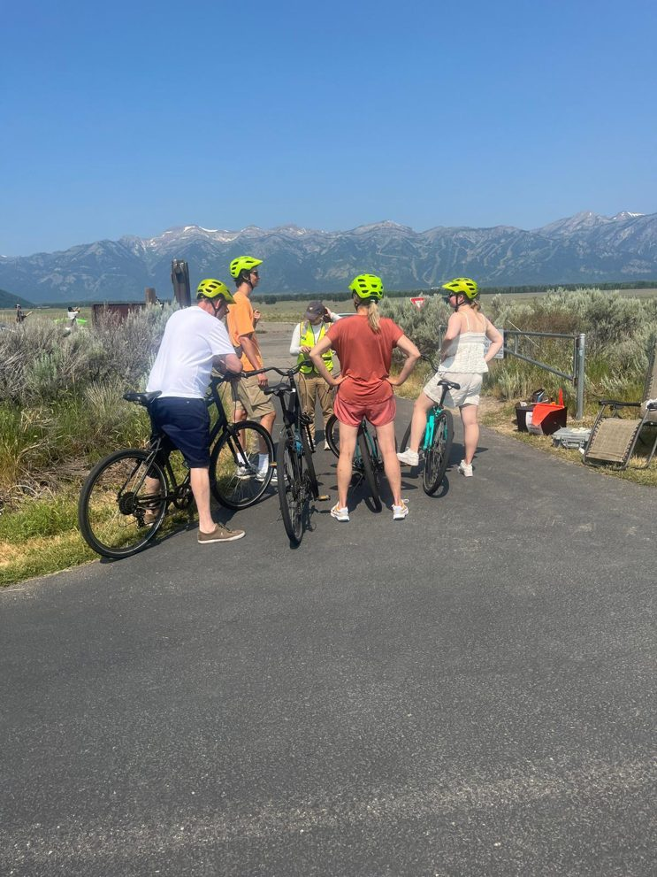

::: {.hero}

::: {.hero-inner}

Tourism and Recreation Analytics for Communities and Ecosystems

<h1>We study how people move through public lands.</h1>

The TRACE Lab at the University of Wyoming's Haub School of Environment and Natural Resources does applied research with the agencies and communities that manage outdoor recreation and tourism across the Western US.

<a class="btn btn-sand" href="work-with-us.html">Work with us</a>
<a class="btn btn-ghost" href="people.html#join-the-lab">Join the lab</a>

:::

:::

::: {.section}

::: {.split}

::: {}

## Who we are

The TRACE Lab is led by Colby Parkinson, Assistant Professor of Outdoor Recreation and Tourism Management at the University of Wyoming. The lab launched in 2026 and grew out of a decade of fieldwork in national parks, forests, and gateway communities: GPS tracking at Grand Canyon, e-bike studies at Grand Teton, and wildfire evacuation planning along the McCarthy Road in Wrangell–St. Elias.

We build the evidence that managers need to make decisions about visitation, and we do it with the people who will use it. That means intercept surveys on trailheads, interviews at kitchen tables, mobile location data at the scale of whole regions, and simulations that let a community rehearse a bad day before it arrives.

The lab is based in Laramie, Wyoming, a morning's drive from Rocky Mountain National Park and a long day from Grand Teton and Yellowstone.

:::

::: {}

Intercept survey on the Grand Teton multi-use pathway.

:::

:::

## What we specialize in

::: {.threads}

::: {.thread}

<h3>Working with the people who manage the land</h3>

We partner directly with federal land management agencies, state and tribal governments, and gateway communities on the questions they need answered. Our work is designed with partners, not delivered to them, and it ends in something a manager can act on.

:::

::: {.thread}

<h3>Understanding what drives visitation, and what it leaves behind</h3>

Visitor use monitoring, mobile location data, onsite GPS tracking, and field surveys explain why people go where they go, how they move once they arrive, and how that reshapes places, ecosystems, and the communities around them.

:::

::: {.thread}

<h3>Taking on hazards, adaptation, and emerging technology</h3>

Wildfire and other hazards, emergency evacuation, adaptation to a changing landscape, and the new sensing tools (edge-AI trail counters, location-based services data, agent-based simulation) that are changing what it's possible to know about visitor use.

:::

::: {.thread}

<h3>Advanced computation and analysis</h3>

Spatial and trajectory analysis of GPS and mobile location data, validation of commercial location datasets against ground truth, agent-based modeling, and reproducible pipelines in Python and R. We treat big data skeptically and make it earn its place alongside what people tell us in person.

:::

::: {.thread}

<h3>Nature, health, and well-being</h3>

Outdoor recreation is a health behavior. Our work has examined how time outdoors, leisure engagement, and access to green space relate to mental health and well-being, from national studies during the COVID-19 pandemic to systematic reviews of nature exposure and health outcomes.

:::

:::

:::

::: {.band}

::: {.band-inner}

::: {}

## Now recruiting M.S. students for 2027

Students join the Environment, Natural Resources, and Society M.S. program at the Haub School. We are considering start dates in Spring 2027 and Fall 2027, with preference for those who can begin in the spring. [See the open call.](people.html#join-the-lab)

:::

::: {.who}

<b>Colby Parkinson, Ph.D.</b>
Assistant Professor, Outdoor Recreation and Tourism Management 
Haub School of Environment and Natural Resources 
University of Wyoming, Laramie 
[cparkin2@uwyo.edu](mailto:cparkin2@uwyo.edu)

:::

:::

:::
