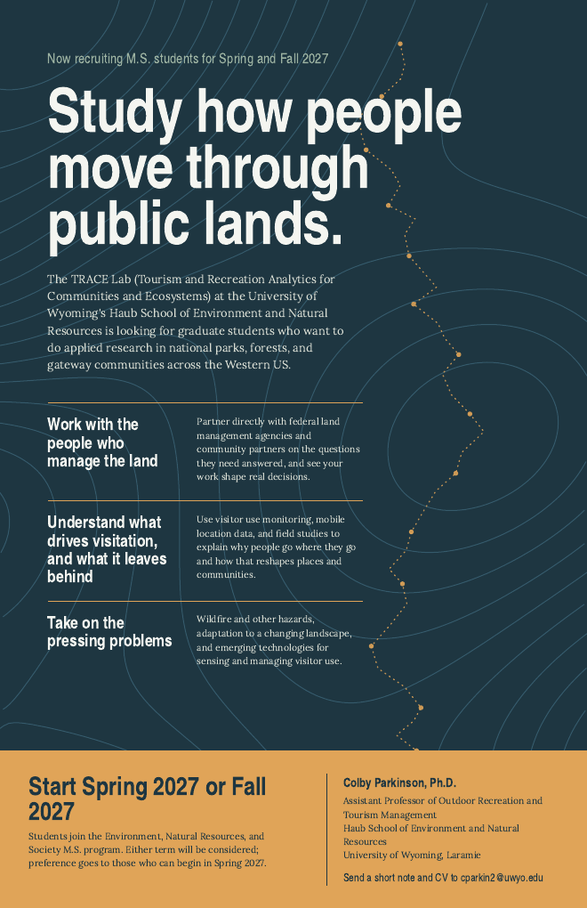

::: {.section}

# People

::: {.people-grid}

::: {.person}

<h3>Colby Parkinson, Ph.D.</h3>

Assistant Professor of Outdoor Recreation and Tourism Management

Colby leads the TRACE Lab, with research that centers on (i) visitor use monitoring techniques and methodology, (ii) the relationship between nature and health, and (iii) emergency management and adaptation in gateway communities and destinations. He holds a dual-title Ph.D. in Recreation, Park, and Tourism Management and Social Data Analytics from Penn State, an M.S. in Forest Ecosystems and Society from Oregon State, and a B.A. in Public Relations and Strategic Communications from American University. Colby currently serves on the board of the Society of Outdoor Recreation Professionals.

[Email](mailto:cparkin2@uwyo.edu) · [ORCID](https://orcid.org/0000-0001-8897-8844) · [University Webpage](https://www.uwyo.edu/haub/about-us/people/parkinson-colby.html) 

:::

::: {.person .open}

This could be you

<h3>You?</h3>

Graduate Research Assistant · M.S. student, starting 2027

The lab opened in 2026 and, at the time of writing, the entire roster fits in the first column of this page. That's not a bug. Joining now means you help shape the lab and support early field seasons. [See the open call below.](#join-the-lab)

:::

:::

## Join the lab

::: {.split}

::: {}

The TRACE Lab is recruiting **M.S. students** to start in **Fall 2027**.

Students join the **Environment, Natural Resources, and Society M.S. program** in the Haub School of Environment and Natural Resources at the University of Wyoming, and work in one or more of the lab's areas:

- Partnering with federal land management agencies and community partners on the questions they need answered
- Understanding what drives visitation and what it leaves behind, using visitor use monitoring, mobile location data, and field studies
- Taking on pressing environmental problems: wildfire and other hazards, adaptation to a changing landscape, and emerging technologies for sensing and managing visitor use

**Who does well here.** People who like being outside and being in front of a terminal in roughly equal measure. Some comfort with or a desire to learn coding lanuages like Python helps; curiosity about data matters more than existing skill. Experience working with land management agencies, communities, or in outdoor recreation is a plus but not required.

**How to apply.** Send a short note describing what you'd want to work on and why, along with a CV, to [cparkin2@uwyo.edu](mailto:cparkin2@uwyo.edu). Please also share your GRE scores if you have them. Strong candidates will be invited to a conversation before applying to the program formally.

[Download the recruitment poster (PDF)](assets/TRACE_Lab_MS_Recruitment_Poster.pdf)

:::

::: {}

:::

:::

:::
