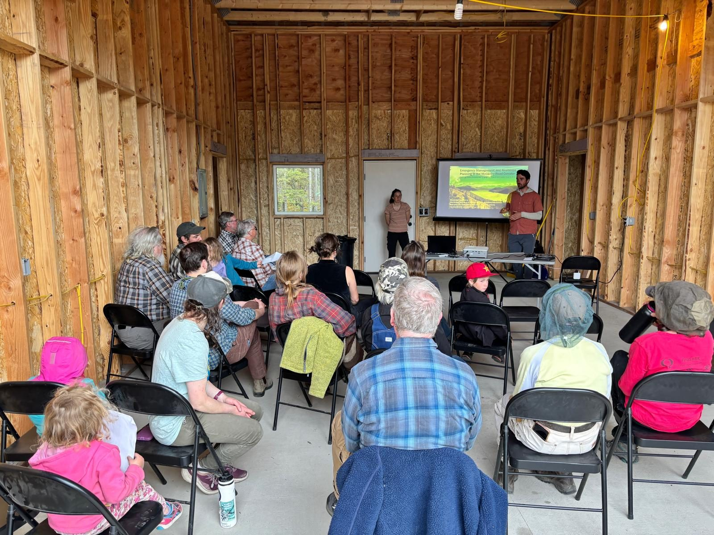
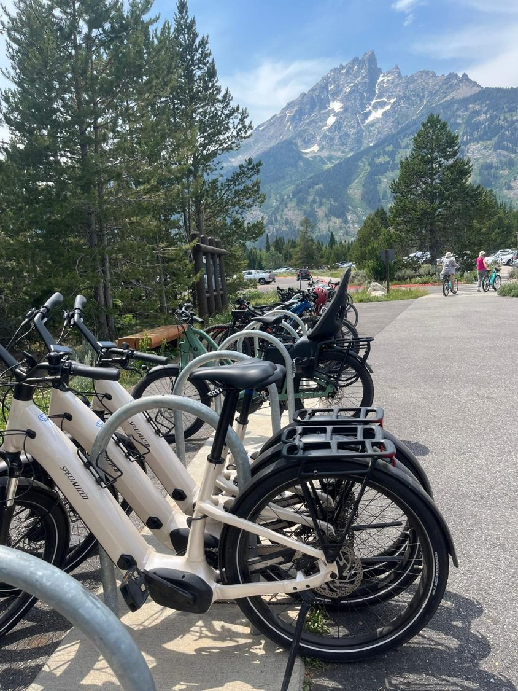
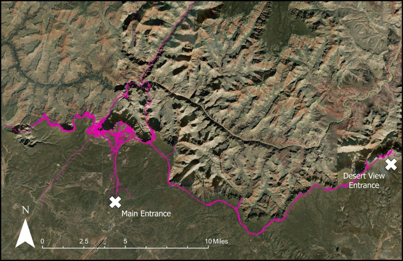

::: {.section}

# Projects

Recent and ongoing work, most of it in Alaska and the Northern Rockies. Most of it is done in partnership with a land management agency, and most of it ends in something a manager or a community can use.

::: {.project .featured}

::: {}

Presenting findings to residents in McCarthy, Alaska.

Wrangell–St. Elias National Park and Preserve, Alaska National Park Service, 2024–2027 Co-PI with Bing Pan (PI), Haizhong Wang, B. Derrick Taff, and Peter Newman

:::

::: {}

## Emergency management and resilience planning in the McCarthy Road Corridor

The McCarthy Road is a 60-mile gravel road that is the only way in or out for the communities of McCarthy and Kennicott and for the tens of thousands of visitors who reach them each summer. Wildfire, flooding, and washouts can close it with little warning. This project asks a simple question with a complicated answer: if the corridor had to be evacuated, what would actually happen?

We are answering it with mixed methods. Intercept surveys of residents and visitors along the road capture who is there, what they know, and what they would do. Stakeholder interviews with agency staff, business owners, and residents map out the decisions and communication channels that an evacuation would depend on. Participatory observation and an agent-based simulation of traffic on the road test how those decisions play out under different fire scenarios.

In June 2026 the lab facilitated an interagency tabletop exercise in McCarthy with partners from the National Park Service, the State of Alaska, the Chitina Native Village, and the communities of McCarthy, Chitina, and Gakona, walking through a wildfire evacuation scenario together for the first time. Findings have been presented back to community members in Chitina, McCarthy, and Kennicott in 2025 and 2026, and a [risk assessment and emergency response technical report](https://osf.io/muecz) is available through the National Park Service and OSF. Colby also serves on the Native Village of Chitina's Climate Change Adaptation Planning Committee.

<b>60</b>miles of single-access road

<b>~400</b>residents and visitors surveyed

<b>1</b>interagency evacuation exercise, June 2026

:::

:::

::: {.project}

::: {}

Grand Teton National Park, Wyoming UW–NPS Research Station, 2023–2025 PI

:::

::: {}

## E-bikes and cyclists on the Grand Teton multi-use pathway

E-bikes are changing who rides on park pathways and how far they go, and managers have had little data to write policy from. This project combined onsite observation, rider surveys, and GPS tracking to compare e-bikers with conventional cyclists in behavior, sociodemographics, and recreation specialization. Results have been reported to the park and presented at the George Wright Society's ParkForum to inform e-bike policy on public lands.

:::

:::

::: {.project}

::: {}

Visitor GPS tracks between the Main and Desert View entrances.

Grand Canyon National Park, Arizona National Park Service and Penn State, 2022–2025

:::

::: {}

## Validating mobile location data against GPS tracks at Grand Canyon

Commercial location-based services (LBS) data promise a view of visitor movement at a scale that no survey can match, but nobody had checked whether that view was accurate. Working from a South Rim visitor use study that handed GPS loggers to visitors as they entered the park, we compared LBS trajectories to what people actually did. The result, published in *Sustainability*, is one of the first direct validations of LBS data for park visitor behavior and a set of cleaning procedures now used in follow-on work.

:::

:::

## Frameworks

Alongside site-specific work, the lab develops tools other researchers and managers can use. The **Tourist Monitoring Compass**, published in the *Journal of Hospitality and Tourism Horizons* in 2025, links the measurements available for nature-based tourism monitoring (counters, surveys, mobile data, social media) with the constructs managers care about, so that a monitoring program can be designed backward from the decision it needs to support.

:::
